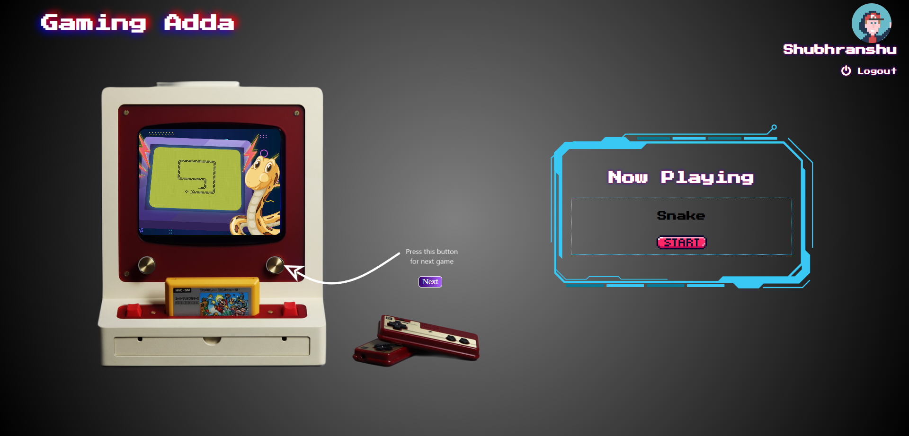
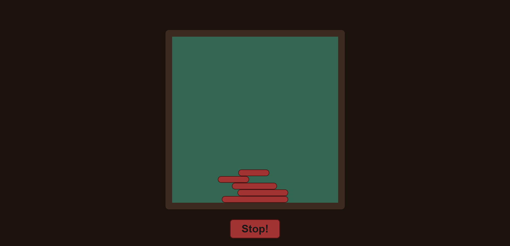

# GamingAdda

## Title:

Gaming Website

## Description:

Welcome to our website, a fun and engaging platform that features a variety of mini-games suitable for all age groups. Our website offers classic games such as
tic-tac-toe, sudoku, snake and ladder, and many more. The purpose of our website is to provide a playful and entertaining experience to users of all ages.Our
user-friendly interface allows easy navigation and clear instructions on how to play each game. The website's design is colorful and visually appealing, making it
more attractive to users. We have also included a high score table, where users can compare their scores with others. In addition to classic games, we have also
incorporated modern games that are popular among all age groups. Our website will be updated periodically with new games to ensure that our users always have something
fresh and exciting to play. We are building our website using HTML, CSS, and JavaScript, to provide an optimized and seamless experience for our users. Our fast
loading times and responsive design ensure that the website is easily accessible to all.
Overall, our website provides a fun and engaging platform that brings together users of all age groups to enjoy their favorite mini-games in one place.

---

**LogIn Page**

---

**Home Page**

---

**Game 1: Snake**

---

**Game 2: Racing Motto**

---

**Game 3: Sudoku**

---

**Game 4: Tic Tac Toe**

---

**Game 5: Dragon Fire**

---

**Game 6: Tower Bilder**

---

**Game 7: Catch The Banana**

---

## Project Use:

Our user-friendly interface allows easy navigation and clear instructions on how to play each game. The website's design is colorful and visually appealing, making it
more attractive to users. We have also included a high score table, where users can compare their scores with others. In addition to classic games, we have also
incorporated modern games that are popular among all age groups. Our website will be updated periodically with new games to ensure that our users always have something
fresh and exciting to play. We are building our website using HTML, CSS, and JavaScript, to provide an optimized and seamless experience for our users. Our fast
loading times and responsive design ensure that the website is easily accessible to all.
Overall, our website provides a fun and engaging platform that brings together users of all age groups to enjoy their favorite mini-games in one place.

## Team Description:

In this project we have 7 members and a mentor.

Shubhranshu : created login/home page and snake game.

Ankit Gupta: created tictactoe game.

Varnit Agrawal : created sudoku game.

Shashank Shekhar: created catch the banana game.

Gaurav: created dragon fire game.

Saurav: crated racing motto game.

Trinay Bhati: created tower builder game.

mentor: Jayesh G
Guidance throughout the whole project.
